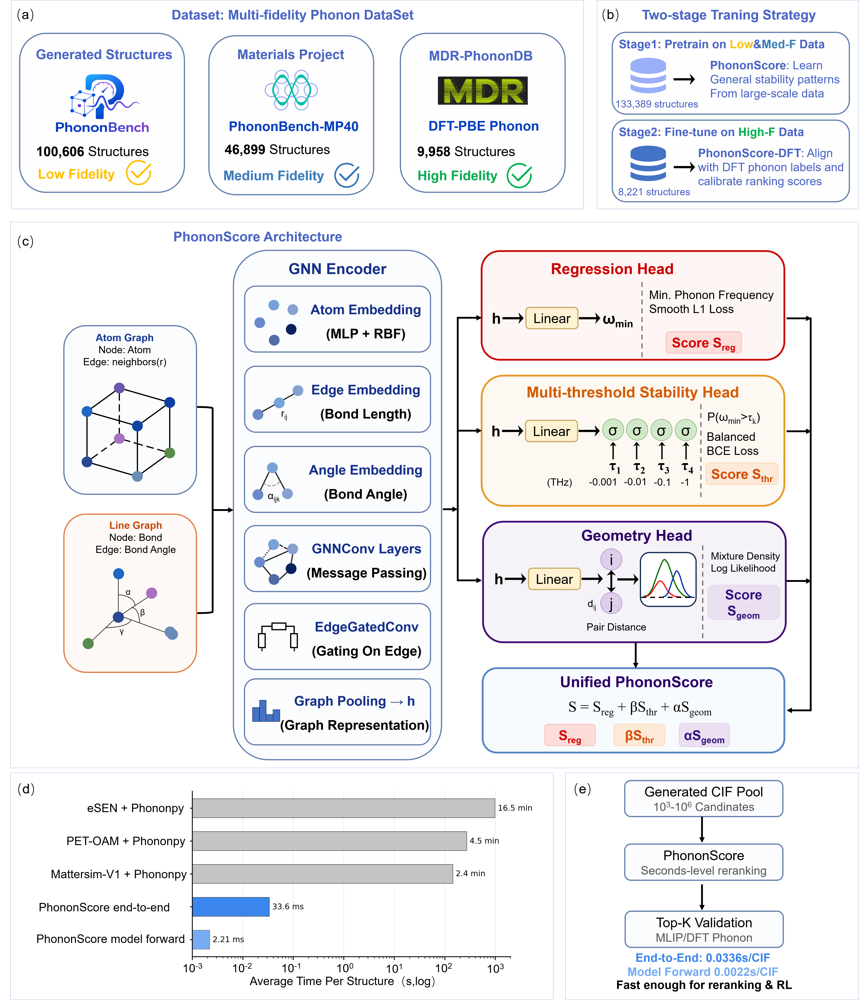

# PhononScore

PhononScore is a phonon-aware scoring function for fast dynamical-stability ranking of crystalline materials.
It takes CIF structures as input and returns a continuous score for candidate-pool reranking before expensive
phonon calculations.



This repository contains a first local release package with:

- `PhononScore`: pretrained on MatterSim phonon labels from generated structures and MP40 structures.
- `PhononScore-DFT`: initialized from PhononScore and post-trained on DFT-PBE phonon labels.
- A CIF-folder scoring script for GPU/CPU direct inference without LMDB.
- Example CIF files and a CPU smoke test.

## Dataset

The split manifests and corresponding CIF files used for the PhononScore experiments are archived on Zenodo:

```text
https://zenodo.org/records/21157982
```

The Zenodo archive contains `phonon_scoring_json_cif_bundle_seed20260605_allgen.zip`, which bundles the four main
`seed20260605` data splits used in this work:

| Split | Records | Description |
| --- | ---: | --- |
| `pretrain` | 133,389 | MatterSim phonon labels from generated crystal candidates and MP40 structures. |
| `dft_posttrain` | 8,221 | DFT-PBE phonon labels used to post-train PhononScore into PhononScore-DFT. |
| `test_mp20_8models` | 8,000 | Held-out generated structures from eight MP20 crystal generation models. |
| `test_dft_pbe_balanced` | 1,000 | Balanced DFT-PBE held-out test set with 500 stable and 500 unstable structures. |

Each split directory contains the original JSON manifest, a `cifs/` folder with the copied CIF files, and a
`local_manifest.json` file whose `cif_path` points to the local copied CIF. The original source path is preserved
as `original_cif_path`.

This dataset archive is intended for reproducing the training/test splits and evaluation analyses. It is not
required for the quick-start inference example below, because this repository already includes model checkpoints
and a small set of example CIF files.

After downloading the archive, it can be unpacked with:

```bash
unzip phonon_scoring_json_cif_bundle_seed20260605_allgen.zip
```

## Repository Layout

```text
phononscore/
  models/                  # ALIGNN + periodic geometry-likelihood model definition
  inference/score_cifs.py  # user-facing CIF scoring entry point
third_party/alignn-main/   # bundled ALIGNN source used by the current model
checkpoints/
  phononscore_pretrain/
  phononscore_dft/
configs/config_min_phonon.json
examples/cifs/
scripts/smoke_test.sh
```

## Environment

The recommended environment file uses the full dependency stack exported from the working `my_alignn` conda
environment used to train, evaluate, and smoke-test the released checkpoints. For the public release, the
environment is named `phononscore`.

Create the release environment on a fresh machine:

```bash
conda env create -f environment.yml
conda activate phononscore
```

For provenance, the raw export from the local development machine is saved as
`docs/environment-my_alignn-raw.yml`; the public `environment.yml` removes the machine-specific `prefix` and
renames the environment to `phononscore`.

## Quick Start

Run a CPU smoke test:

```bash
bash scripts/smoke_test.sh
```

Score a folder of CIF files with GPU inference:

```bash
python -m phononscore.inference.score_cifs \
  --input path/to/cif_directory \
  --out results/phononscore_dft_scores.csv \
  --model phononscore_dft \
  --device cuda \
  --batch-size 32
```

This writes two files:

```text
results/phononscore_dft_scores.csv
results/phononscore_dft_scores.txt
```

The CSV contains all per-structure scores sorted by `standardized_score`. The TXT file records the model,
actual device, batch size, number of scored/failed CIFs, timing, throughput, and the top-ranked structures.
If CUDA is requested but no GPU is available, the script automatically falls back to CPU and records the actual
device in the TXT summary.

Use the MatterSim-pretrained model:

```bash
python -m phononscore.inference.score_cifs \
  --input examples/cifs \
  --out examples/example_scores_pretrain.csv \
  --model phononscore_pretrain \
  --device cuda \
  --batch-size 32
```

## Benchmark 1000 CIFs on One GPU

To measure the fastest single-GPU inference throughput for a CIF directory, run:

```bash
python scripts/benchmark_1000_cifs.py \
  --input path/to/cif_directory \
  --gpu 0 \
  --batch-sizes 1,2,4,8,16,32,64,128,256 \
  --max-cifs 1000
```

The benchmark exposes only one GPU through `CUDA_VISIBLE_DEVICES`, tests the requested batch sizes in order,
and stops at the first CUDA out-of-memory error by default. Each batch-size run writes its own `scores.csv`,
`scores.txt`, and `run.log`; the benchmark also writes:

```text
outputs/benchmark_1000_cifs/<model>_<timestamp>/benchmark_results.csv
outputs/benchmark_1000_cifs/<model>_<timestamp>/benchmark_summary.txt
```

Use `--allow-cpu` only for checking that the benchmark script itself works on a CPU-only machine.

## Output Columns

```text
id,cif_path,cif_name,cif_stem,resolved_cif_path,resolved_cif_name,resolved_cif_stem,formula,n_atoms,prediction,threshold_score,pair_geometry_score,final_score,standardized_score
```

- `id`: input CIF stem used for sorting/reporting.
- `cif_path`, `cif_name`, `cif_stem`: path/name/stem of the file passed to the scorer.
- `resolved_cif_path`, `resolved_cif_name`, `resolved_cif_stem`: symlink-resolved source CIF path/name/stem. These columns help trace benchmark subset files back to the user's original materials.
- `prediction`: minimum-phonon-frequency regression head.
- `threshold_score`: mean probability from the multi-threshold stability head.
- `pair_geometry_score`: periodic local geometry log-likelihood from the MDN geometry branch.
- `final_score`: raw checkpoint score, using the training-time internal weights.
- `standardized_score`: candidate-pool reranking score after z-score normalization.

For a candidate pool, the default paper-style reranking score is:

```text
standardized_score =
    z(prediction)
  + 2.0 * z(threshold_score)
  + 0.25 * z(pair_geometry_score)
```

For a single CIF, `standardized_score` is reported as `NA`, because z-score calibration requires a pool.

## Model Notes

PhononScore is a ranking model, not a replacement for explicit phonon calculations. It is intended to enrich
dynamically stable structures in the top-ranked part of a candidate pool. Final candidates should still be
validated by MatterSim/PhononBench or DFT phonon calculations.

## License

The PhononScore release code is MIT licensed. The bundled ALIGNN source under `third_party/alignn-main` retains
its original license; see `third_party/alignn-main/LICENSE.rst`.
